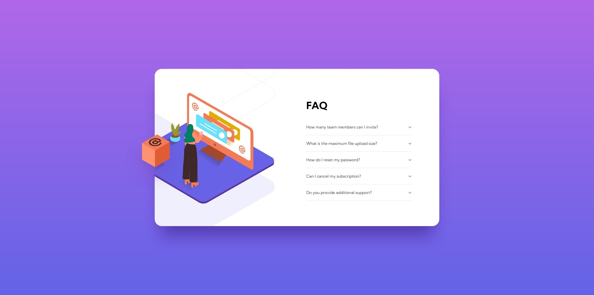

# Frontend Mentor - FAQ accordion card solution

This is a solution to the [FAQ accordion card challenge on Frontend Mentor](https://www.frontendmentor.io/challenges/faq-accordion-card-XlyjD0Oam).

## Table of contents

- [Overview](#overview)
  - [The challenge](#the-challenge)
  - [Screenshot](#screenshot)
  - [Links](#links)
- [Author](#author)

## Overview

### The challenge

Users should be able to:

- View the optimal layout for the component depending on their device's screen size
- See hover states for all interactive elements on the page
- Hide/Show the answer to a question when the question is clicked

### Screenshot

### Links

- Live Site URL: [Add live site URL here](https://ekizashvilit.github.io/faq-accordion-card/)

## Author

- LinkedIn - [Teona Ekizashvili](https://www.linkedin.com/in/teona-ekizashvili-ba5725239/)
- Twitter - [@ekizashvilit](https://twitter.com/ekizashvilit)
